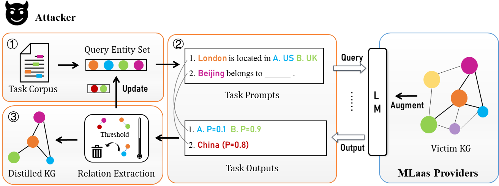

# KGDist: A Prompt-Based Distillation Attack against LMs Augmented with Knowledge Graphs
This repository contains the PyTorch implementation of "A Prompt-Based Distillation Attack against LMs Augmented with Knowledge Graphs". Our paper is accepted by the RAID 2024.

## Introduction
This code includes experiments for paper "A Prompt-Based Distillation Attack against LMs Augmented with Knowledge Graphs".

The following is the workflow of KGDist:



## Case 1 (GreaseLM):
For distillation on GreaseLM, we modified the code from the [original repository](https://github.com/snap-stanford/GreaseLM), please refer to the original settings and rebuild the environment in the `./GreaseLM` folder.

The inital entity and relation list should be placed as `./distill_lab/relations.txt` and `./distill_lab/entities.txt`.

Distillation:
```bash
CUDA_VISIBLE_DEVICES=0,1  bash ./distill_greaselm.sh distill_obqa --data_dir ./data/ --load_model_path [CHECKPOINT_PATH]
```

## Case 2 (KnowBERT):
For distillation on KnowBERT, we modified the code from the [original repository](https://github.com/allenai/kb), please refer to the original settings and rebuild the environment in the `./KnowBERT`. 

The inital entity and relation list should be placed as `./distill_lab/relations.txt` and `./distill_lab/entities.txt`.

Distillation (Single token entities):
```bash
CUDA_VISIBLE_DEVICES=0,1  python distill.py --archive_file [CHECKPOINT_PATH] --epoch 500
```

Distillation (Multiple token entities with a max length resriction):
```bash
CUDA_VISIBLE_DEVICES=0,1  python distill_n.py --maxlen 5 --archive_file [CHECKPOINT_PATH] --epoch 500
```
